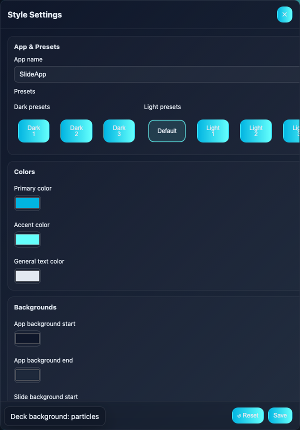

# Authoring Guide

This guide covers the frontmatter keys, per‑slide options, and validation so you can author decks confidently.

## Deck‑level frontmatter

Put a YAML‑like block at the very start of your Markdown file:

```
---
app-name: My Talk
theme-primary: "#007ACC"
theme-accent: "#3C9DFF"
theme-text: "#d4d4d4"
background: particles   # gradient | particles | off
defaults-title-size: 28 # 12..64
defaults-subtitle-size: 16 # 10..48
defaults-slide-opacity: 0.85 # 0..1 or 0..100 or '85%'
content-pos: mm         # tl|tm|tr|ml|mm|mr|bl|bm|br
---
```

Notes
- Title precedence: the browser tab uses `app-name` (when present). If absent, it uses the Style UI app name.
- Colors accept 3 or 6 digit hex (quotes optional) and are normalized internally.
- `content-pos` sets the default content block position within the slide frame.

## Per‑slide frontmatter

Slides are separated by a line that is exactly `---`. You can put a frontmatter block immediately after a separator to control that slide:

```
---
title: Slide A
subtitle: Demo
overlay: true                 # show slide title/subtitle overlay
overlay-pos: br               # tl|tr|bl|br
overlay-subtitle: on          # on|off|true|false|1|0
overlay-subtitle-size: 18     # 10..48
overlay-subtitle-color: accent# primary|accent
slide-bg1: "#1f2428"           # optional per‑slide background gradient start
slide-bg2: "#1b2024"           # optional per‑slide background gradient end
content-pos: mr               # per‑slide content position
---
```

## Validation

In‑app
- Click “Validate” (🔎) in the header to lint the current deck. Unknown keys or out‑of‑range values show clear messages; legacy keys include suggestions.

CLI
```
npm run validate:deck -- path/to/deck.md
```

What’s checked
- Unknown deck/slide keys (including support for the new `content-pos` and `overlay-subtitle*` keys).
- Value ranges (title/subtitle sizes, opacity, overlay positions, subtitle color).

## Static Site Mode

To publish decks from the repo:
- Place `.md` files under `content/`.
- Add them to `slides.json`:

```
{ "decks": [ { "title": "Demo", "path": "content/demo.md" } ] }
```

Open `slider.html` (Pages or local server). If `slides.json` lists multiple decks, a 📚 Decks button lets you pick one. You can deep‑link to a deck with `?deck=content/demo.md`.

## Tips
- Use the Style (🎨) modal to tweak colors, overlay defaults, and opacity while previewing slides. Save will persist to localStorage if “Persist” is enabled.
- Keyboard: B (background), T (opacity), U (UI), O (outline), S (slides), N (notes).

## Style modal layout

The redesigned Style modal organizes controls into responsive columns so the same content works from mobile widths through widescreen desktops.

Wide viewport (≥ 1024px)


Narrow viewport (≤ 640px) stacks sections vertically while keeping sticky headers for each group.



When the browser reports “reduced motion,” section dividers and overlays skip animated transitions but keep the same structure.


## Preset themes

The built-in presets now borrow color systems from popular editor themes so slides feel familiar in developer contexts. Each preset defines primary/accent hues, application backgrounds, slide chrome, and whether the buttons use a filled or outlined style by default.

- Dark+ (Default) — VS Code inspired blues with outlined buttons.
- Monokai Sunset — dark charcoal with magenta/cyan highlights and solid buttons.
- Nord Night — dark slate with ice accents and outlined buttons.
- Solarized Twilight — teal/blue duotone on deep cyan with outlined buttons.
- High Contrast Slate — accessibility-focused dark preset with vivid outlines.
- Arctic Daylight — Nordic-inspired light theme with outlined buttons.
- VS Minimal Light — crisp light UI inspired by VS Code, outlined buttons.
- Solarized Day — warm paper-like light preset with soft filled buttons.
- Nimbus Mono — cool-neutral light preset with solid translucent buttons.

## Button styling

Global controls that affect the application buttons (header, footer, and controls):

- Button text color
  - Deck key: `button-text-color: auto | <#rrggbb>`
  - Style UI: “Button text color” → Auto or Custom
  - Behavior:
    - `auto` chooses a readable black/white based on your theme’s primary/accent mix.
    - `#rrggbb` uses the supplied color exactly.
- Button fill
  - Deck key: `button-fill: solid | outline`
  - Style UI: “Button fill” → Solid or Outline
  - Behavior:
    - Solid uses the theme gradient fill (default).
    - Outline removes the fill but keeps the button outline/border and text color.
- The default Dark+ preset ships with outlined buttons using a 1 px border; adjust `Button fill` or border width in the Style modal if you need heavier chrome.

External config
- JSON keys mirror the Style UI / deck keys:
  - `btnTextColor`: "auto" | "#rrggbb"
  - `btnFill`: "solid" | "outline"

Validation
- The validator accepts these keys. Unknown values (e.g., `button-fill: glass`) will be flagged with a clear message.
